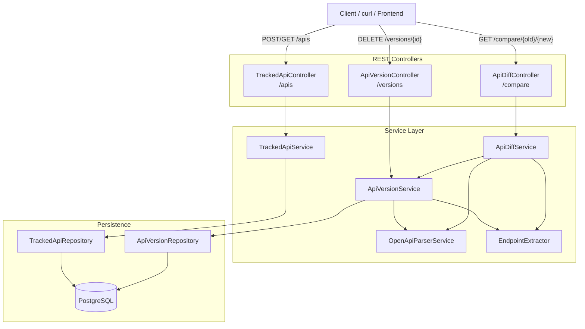

# Drift


**Drift** is an API version drift detection tool. It tracks OpenAPI specifications over time, stores versioned snapshots, and compares any two versions to surface endpoint-level changes and breaking changes.

---

## Architecture



---

## Features

- **Track APIs** — Register API definitions to monitor
- **Version snapshots** — Upload OpenAPI 3.x specifications (YAML/JSON) under semantic versions
- **Endpoint diffing** — Automatically detect added, removed, and modified endpoints between versions
- **Breaking change detection** — Identify new required parameters, removed parameters, changed request bodies, and deleted responses
- **RESTful API** — Simple JSON API for full lifecycle management

---

## Tech Stack

| Component | Technology |
|---|---|
| Language | Java 21 |
| Framework | Spring Boot 3.5.15 |
| ORM | JPA / Hibernate |
| Database | PostgreSQL 17 |
| Parser | Swagger Parser 2.1.24 |
| Build | Maven |
| Helpers | Lombok, SnakeYAML |

---

## Getting Started

### Prerequisites

- Java 21+
- Docker & Docker Compose (for PostgreSQL)
- Maven (or use the included `./mvnw` wrapper)

### Setup

1. **Clone the repository**

   ```bash
   git clone <repo-url>
   cd Drift
   ```

2. **Configure environment variables**

   Copy the following into `.env`:

   ```env
   DB_NAME=drift
   DB_USERNAME=drift
   DB_PASSWORD=drift
   ```

3. **Start PostgreSQL**

   ```bash
   docker compose up -d
   ```

4. **Run the application**

   ```bash
   ./mvnw spring-boot:run
   ```

   The server starts on `http://localhost:8080`.

---

## API Reference

### Tracked APIs

| Method | Endpoint | Description |
|---|---|---|
| `POST` | `/apis` | Create a tracked API |
| `GET` | `/apis` | List all tracked APIs |
| `GET` | `/apis/{id}` | Get a tracked API by ID |

### Versions

| Method | Endpoint | Description |
|---|---|---|
| `POST` | `/apis/{id}/versions` | Upload a new version (multipart form) |
| `DELETE` | `/versions/{id}` | Delete a version |

### Comparison

| Method | Endpoint | Description |
|---|---|---|
| `GET` | `/compare/{oldVersionId}/{newVersionId}` | Diff two API versions |

---

## Sample Workflow

```bash
# 1. Create a tracked API
curl -s -X POST http://localhost:8080/apis \
  -H "Content-Type: application/json" \
  -d '{"name": "Pet API", "description": "Pet store endpoints"}' | jq

# 2. Upload version 1.0.0
curl -s -X POST http://localhost:8080/apis/1/versions \
  -F "version=1.0.0" \
  -F "file=@src/main/java/com/yash/Drift/samples/sample.yaml" | jq

# 3. Upload version 2.0.0 (after modifying the spec)
curl -s -X POST http://localhost:8080/apis/1/versions \
  -F "version=2.0.0" \
  -F "file=@/path/to/updated-spec.yaml" | jq

# 4. Compare the two versions
curl -s http://localhost:8080/compare/1/2 | jq
```

**Sample response:**

```json
{
  "addedEndpoints": ["POST /pets"],
  "removedEndpoints": [],
  "commonEndpoints": ["GET /pets"],
  "modifiedEndpoints": [],
  "endpointChanges": [],
  "breakingChanges": []
}
```

---

## Project Structure

```
Drift/
├── docker-compose.yml
├── pom.xml
└── src/main/java/com/yash/Drift/
    ├── DriftApplication.java
    ├── controller/
    │   ├── TrackedApiController.java
    │   ├── ApiVersionController.java
    │   └── ApiDiffController.java
    ├── diff/
    │   ├── ApiDiffService.java
    │   └── EndpointExtractor.java
    ├── dto/
    │   ├── ApiDiffResponse.java
    │   ├── ApiVersionResponse.java
    │   ├── BreakingChange.java
    │   ├── CreateTrackedApiRequest.java
    │   ├── EndpointChange.java
    │   └── TrackedApiResponse.java
    ├── entity/
    │   ├── ApiVersion.java
    │   └── TrackedApi.java
    ├── exception/
    │   ├── ApiNotFoundException.java
    │   ├── ApiVersionNotFoundException.java
    │   ├── DuplicateApiException.java
    │   └── GlobalExceptionHandler.java
    ├── parser/
    │   └── OpenApiParserService.java
    ├── repository/
    │   ├── ApiVersionRepository.java
    │   └── TrackedApiRepository.java
    ├── samples/
    │   └── sample.yaml
    └── service/
        ├── ApiVersionService.java
        └── TrackedApiService.java
```

---

## License

MIT
